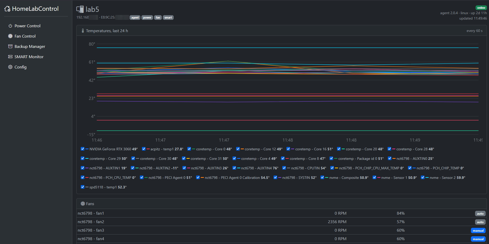
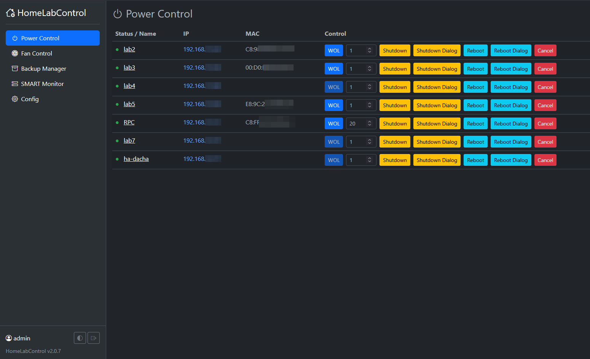
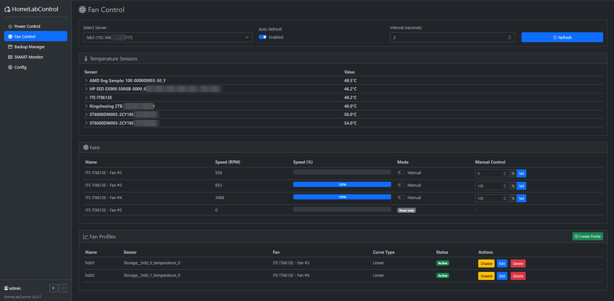
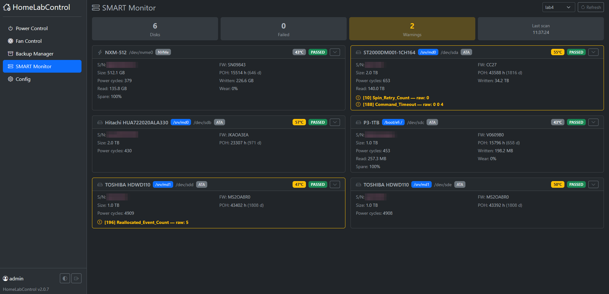
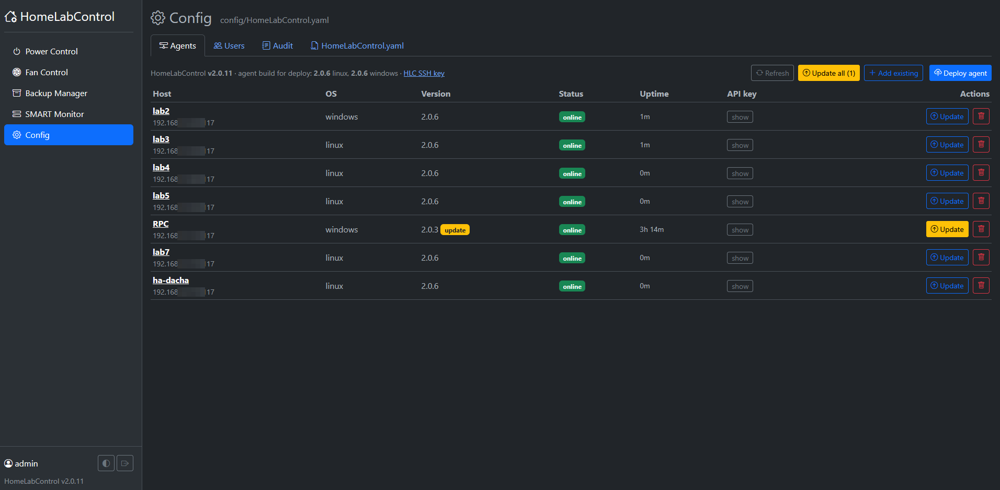
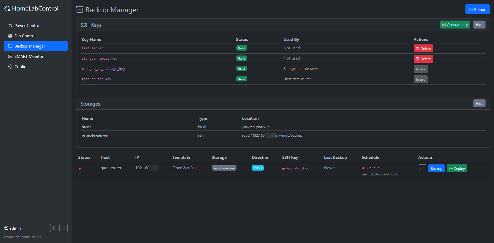
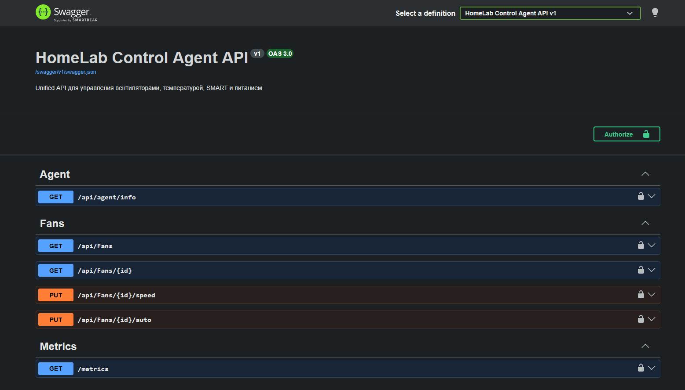
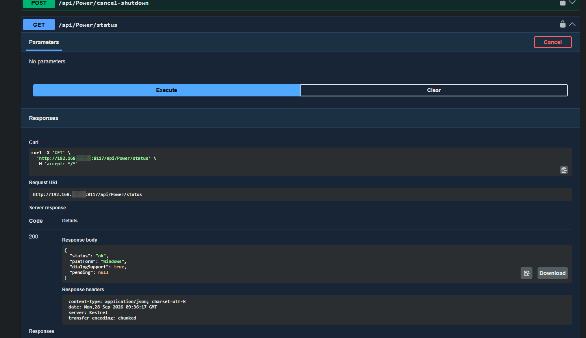

Веб-панель для домашней лаборатории: питание машин (WoL / выключение / перезагрузка), вентиляторы по температурным кривым, SMART дисков, бэкапы конфигов, деплой и обновление агентов.<br><br>

# HomeLabControl

A self-hosted web panel for a home lab. One UI for powering machines on and off, fan curves, disk health, config backups — and a small agent on every machine that does the actual work.

<table>
  <tr>
    <td width="33%"><br><sub>Host page — 24 h temperature chart, fans, disks</sub></td>
    <td width="33%"><br><sub>Power Control — WoL, shutdown / reboot, countdown dialog</sub></td>
    <td width="33%"><br><sub>Fan Control — sensors, fans, fan profiles</sub></td>
  </tr>
  <tr>
    <td><br><sub>SMART Monitor — health and warnings of every disk</sub></td>
    <td><br><sub>Config → Agents — versions, health, deploy / update</sub></td>
    <td><br><sub>Backup Manager — keys, storages, scheduled backups</sub></td>
  </tr>
</table>

## Features

- **Power Control** — Wake-on-LAN (also into other subnets through a relay), shutdown / reboot (immediate or delayed, cancellable), Windows countdown dialog in the user session, online status by ping, host groups ("shut down the whole lab")
- **Automation** — scheduled tasks like "03:00: wake the backup NAS → run backups → shut it down": cold, offline backups without anyone pressing buttons; a machine that was already on is never shut down by a task
- **Fan Control** — sensors and fans of every machine, manual PWM, **fan profiles** with linear / spline / exponential / custom-formula curves and hysteresis; fail-safe to 100% on errors or a lost sensor; fans go back to BIOS control when a profile is disabled or the agent stops
- **SMART Monitor** — health, temperature, wear, power-on hours, ATA attributes and NVMe health log of all disks (`smartctl -j`)
- **Backup Manager** — scheduled backups of anything reachable over SSH, first of all configs: `/etc`, docker-compose stacks, Home Assistant, router settings. Backups are shell-command templates in push or pull mode, with cron schedule, retention, run history with logs, and SSH key generation and deployment
- **Host page** — status, CPU / memory and temperature charts, disk space, network, fans, disks and backups of a machine on one page
- **Agents panel** — version, health and uptime of every agent; **deploy / update / update all / remove** over SSH from the UI (update all goes through every host and reports failures at the end); the agent build is bundled into the container image
- **Manual agent install** — install scripts for Windows and Linux in every agent build; a hand-installed agent is registered with **Add existing**
- **Runs in Docker or without it** — self-contained builds for Windows (service) and Linux (systemd) with install scripts
- **Home Assistant via MQTT discovery** — every machine appears as a device with online status, CPU / memory / free disk space, temperatures, fans, disk problems, active alerts and Wake-on-LAN / shutdown / reboot buttons
- **Alerts and notifications** — disk running out of space, overheating (thresholds per hardware class), SSD wear, agent offline / back online, SMART degradation, a fan profile that lost its sensor, failed backups or automation tasks → Telegram and/or MQTT
- **Prometheus** — `/metrics` on every agent (CPU, memory, disk space, network, temperatures, fans, SMART)
- **Security**
  - login with users, per-module permissions (`view` / `control`, `admin` for config, agents and users) and optional per-host restriction
  - audit log: who did what and when (power actions, fans, backups, deploys, config, users)
  - agent API protected by a per-host API key (the same key for HomeLabControl and Home Assistant)
  - updates over HomeLabControl's own SSH key, automatic rollback if an updated agent does not start
- **Single YAML config** with an in-browser editor (validation on save, hot reload); old per-module configs are migrated automatically
- Light / dark theme

## Components

| | Runs on | Port |
|---|---|---|
| **HomeLabControl** — Blazor Server UI + REST | Docker, or a Windows / systemd service | 8208 |
| **HomeLabControlAgent** — sensors, fans, SMART, power | every machine: Windows service or systemd | 8117 |
| **ShutdownDialog** — countdown window before shutdown | Windows, installed with the agent | — |

```
 Browser ──▶ HomeLabControl (Docker) ── SSH ──▶ deploy / update agents
                    │ HTTP + X-Api-Key
        ┌───────────┼───────────┐
        ▼           ▼           ▼
      Agent       Agent       Agent  ◀── Home Assistant rest_command (agent key)
     (Linux)    (Windows)      ...
```

The agent is published self-contained, so machines need neither .NET nor libicu. Linux uses hwmon, `smartctl` and `nvidia-smi`; Windows uses LibreHardwareMonitor and WMI.

## Quick start

```yaml
# docker-compose.yml
services:
  homelabcontrol:
    image: ghcr.io/rsvln/hlc:latest
    container_name: homelabcontrol
    network_mode: host                  # Wake-on-LAN broadcast and ping
    environment:
      HLC_ADMIN_USER: admin             # administrator, created / restored on every start
      HLC_ADMIN_PASSWORD: "change-me-please"
      TZ: Europe/Moscow
    volumes:
      - ./config:/app/config            # HomeLabControl.yaml, users.yaml, keys/, SSH deploy key
    restart: unless-stopped
```

```bash
docker compose up -d
```

1. Open `http://<host>:8208` and sign in as `HLC_ADMIN_USER`.
2. **Config → HomeLabControl.yaml** — describe your machines (see the [example](HomeLabControl/config/HomeLabControl.yaml)).
3. **Config → Agents → Deploy agent** — IP, OS, SSH user and password (only the first time). The agent is installed as a service with its own API key; later updates need no password.
4. **Config → Users** — add users with the modules they may see or control.

Images: `ghcr.io/rsvln/hlc:latest` or a specific version (`:2.0.0`, shown at the bottom of the menu).

## Without Docker

HomeLabControl also runs as a plain service, as a Windows service or under systemd.
- **Builds:** `HomeLabControl-<version>-win-x64.zip` / `-linux-x64.tar.gz` from the release.
- **What's inside:** each build is self-contained, so .NET is not needed. It also carries the agent builds for deploy from the UI.
- **Requirements:**
  - Linux needs `libssl`; the script checks for it.
  - Deploying agents and backup keys need `ssh-keygen`: `openssh-client` on Linux, "OpenSSH Client" on Windows.

```bat
install.cmd                                            :: update the installed HLC, or install (asks for path and port)
install.cmd -AdminUser admin -AdminPassword secret123
install.cmd -Uninstall                                 :: removes the service and program, keeps config\
```

```bash
sudo sh install.sh                                     # update the installed HLC, or install (asks for path and port)
sudo sh install.sh --admin admin --password secret123
sudo sh install.sh --uninstall                         # removes the service and program, keeps config/
```

**What the script does:**
- finds an already installed HLC by its service and updates it in place; on a new install asks for the path and port (Enter takes the default, `-InstallPath` / `-Port` or `--path` / `--port` skip the questions);
- copies the program;
- `config/` (config, users, keys) is copied from the build only on the first install; after that the script never touches it;
- registers the service; on Linux it uses `homelabcontrol.service` from the build, which also works for a manual setup;
- on Windows it opens the port in the firewall.

**Settings of the machine** live in `appsettings.Local.json` next to the program. The script creates it, and updates keep it. The keys are the same as the docker-compose environment:

```json
{
  "Urls": "http://0.0.0.0:8208",
  "HLC_ADMIN_USER": "admin",
  "HLC_ADMIN_PASSWORD": "secret123",
  "HLC_BEHIND_PROXY": true
}
```

## Configuration

Everything lives in `config/HomeLabControl.yaml`. Every host has common fields and a section per module; a host takes part in a module only if it has that section:

```yaml
modules:
  power:
    broadcastAddress: 192.168.1.255
    defaultDelaySeconds: 1

hosts:
  - name: desktop
    ip: 192.168.1.10
    mac: AA:BB:CC:00:00:10          # Wake-on-LAN
    agent:                          # filled in by Deploy: port, OS, paths, API keys
      port: 8117
    power:                          # Power Control
      defaultDelaySeconds: 20
    fanControl: {}                  # Fan Control
    smart: {}                       # SMART Monitor

  - name: router
    ip: 192.168.1.1
    backup:                         # Backup Manager
      user: root
      sshKey: /root/.ssh/router_key
      direction: push
      template: OpenWrt Full
      storage: nas
```

The annotated [example config](HomeLabControl/config/HomeLabControl.yaml) lists all settings, including backup storages and templates.

**Upgrading from 1.x.** Separate `PowerControl.yaml` / `FanControl.yaml` / `BackupManager.yaml` are merged into `HomeLabControl.yaml` automatically on the first start:
- hosts are matched by IP;
- the old files are renamed to `*.migrated`;
- the previous `HomeLabControl.yaml` is kept as `.bak`.

**Comments are kept.** Changes made from the UI (deploy, groups, automation tasks, relays) rewrite only the changed blocks of the file; edits made in the Config editor are saved as is.

### Waking hosts in other networks

A Wake-on-LAN packet is a broadcast and does not cross routers or VPNs. For a host in another subnet, something inside that network has to send it — a **relay**. Relays are managed in Power Control (**Wake-on-LAN relays** grid) or in the config:

```yaml
modules:
  power:
    wolRelays:
      - name: dacha
        subnet: 192.168.12.0/24     # hosts with an IP in this subnet are woken through this relay
        type: ssh                   # the network's gateway (OpenWrt or any Linux) runs etherwake
        address: 192.168.12.1
        sshUser: root               # default
        interface: br-lan           # default
      - name: dacha-ha
        subnet: 192.168.12.0/24
        type: agent                 # any always-on host with an agent (2.0.11+) in that network
        host: ha-dacha
```

- **SSH relay.** HLC connects with its own SSH key and runs `etherwake -i <interface> <mac>` (or `ether-wake` / `wakeonlan`). Nothing else is installed on the gateway. **Setup** asks for the SSH password once, installs the HLC key (on OpenWrt into `/etc/dropbear/authorized_keys`) and, on OpenWrt, `opkg install etherwake`.
- **Agent relay.** HLC calls `POST /api/power/wol` on that agent with its key.
- **Choice.** The relay with the narrowest matching subnet wins. `power.wolVia: <relay>` on a host picks one explicitly; `wolVia: local` always uses a broadcast from HLC's own network.
- **Test** checks the connection and that a wake tool is present. The WOL button tooltip and the audit log show which relay was used.

## Home Assistant

**MQTT discovery (recommended).** Enable `modules.mqtt` — HomeLabControl polls the agents and publishes every machine as a device:

```yaml
modules:
  mqtt:
    enabled: true
    host: 192.168.1.20
    port: 1883
    username: hlc
    password: "..."
    discoveryPrefix: homeassistant   # default
    baseTopic: hlc                   # states: hlc/<host>/..., availability: hlc/status
    commands: true                   # WoL / shutdown / reboot buttons (anyone who can publish to the broker can press them)
```

**REST.** Use the agent's API key, shown in **Config → Agents → API key**:

```yaml
rest_command:
  desktop_shutdown:
    url: "http://192.168.1.10:8117/api/power/shutdown?delay=0"
    method: POST
    headers:
      X-Api-Key: !secret hlca_desktop_key
```

`GET /api/power/status` needs no key and works as a health check.

## Manual agent install

Deploy over SSH is optional: the agent can be installed by hand from a build and then registered in HomeLabControl.

**Builds.** Get them from the release, or run `dotnet publish HomeLabControlAgent -c Release -r win-x64|linux-x64 --self-contained`. Each build is a folder that contains the install script.

**Windows** — run as administrator; `install.cmd` asks for elevation by itself:

```bat
install.cmd                                   :: update the installed agent, or install (asks for path and port)
install.cmd -GenerateKeys                     :: enable the key on an agent that ran without one
install.cmd -Uninstall
```

**Linux** — run with `sudo` (systemd):

```bash
sudo sh install.sh                            # update the installed agent, or install (asks for path and port)
sudo sh install.sh --generate-keys
sudo sh install.sh --uninstall
```

Linux needs `libssl` (.NET requirement); the script checks for it.

**What the script does:**
- copies the files, except `appsettings.Local.json` and `profiles.json`;
- registers the service; on Windows it also adds a firewall rule for the port;
- finds an already installed agent by its service and updates it in place, whatever its path;
- on a new install asks for the path and port; Enter takes the default (`D:\apps\…` if there is a D: drive, else `C:\apps\…`; `/srv/…` on Linux). `-InstallPath` / `-Port` (`--path` / `--port`) skip the questions;
- on a new install, creates `appsettings.Local.json` with a new API key; an existing agent without a key stays open until you run it with `-GenerateKeys` / `--generate-keys`;
- prints the keys at the end.

Running it again from a newer build updates the agent and keeps the keys.

**Registering in HomeLabControl.** Go to **Config → Agents → Add existing** and enter the name, IP, port and the printed API key. HLC checks the agent and adds the host. The same key goes to the HA `rest_command`.

**Settings files next to the agent**

| File | What | Updates |
|---|---|---|
| `appsettings.json` | defaults: port 8117, logging, intervals | overwritten by every update, don't edit |
| `appsettings.Local.json` | this machine: API keys, `ServicePort`, any override of `appsettings.json` | never overwritten |
| `profiles.json` | fan profiles (edited from the UI) | never overwritten |

## Agent API

Base URL `http://<host>:8117`, Swagger UI at `/` (opens without a key; press **Authorize** and enter the agent key to call methods; `"Swagger": { "Enabled": false }` turns it off).

<table>
  <tr>
    <td width="50%"><br><sub>Swagger UI of the agent — <b>Authorize</b> with the agent key</sub></td>
    <td width="50%"><br><sub>Calling a method right from the browser</sub></td>
  </tr>
</table>

**Authentication.** Every call except `GET /api/power/status` and `GET /api/agent/info` needs `X-Api-Key: <key>` (or `Authorization: Bearer <key>`).
- **Where the key lives:** `appsettings.Local.json` next to the agent. A deploy from HomeLabControl or the install script fills it in; updates never overwrite it.
- **No keys configured:** the API is open, and a warning is logged.

| Method | Path | |
|---|---|---|
| GET | `/api/agent/info` | version, OS, uptime, auth state |
| POST | `/api/power/shutdown?delay=N` | shutdown now or in N seconds (0…86400) |
| POST | `/api/power/reboot?delay=N` | reboot |
| POST | `/api/power/shutdown-with-dialog?delay=30&message=…` | Windows: countdown dialog with a Cancel button |
| POST | `/api/power/reboot-with-dialog?delay=30&message=…` | |
| POST | `/api/power/cancel` | cancel a delayed action and close the dialog |
| POST | `/api/power/wol?mac=AA:BB:CC:DD:EE:FF` | send a Wake-on-LAN packet into the agent's networks (relay for HLC) |
| GET | `/api/power/status` | health check |
| GET | `/api/sensors`, `/api/fans` | temperatures, fans |
| PUT | `/api/fans/{id}/speed`, `/api/fans/{id}/auto` | manual PWM / back to BIOS control |
| GET, POST, PUT, DELETE | `/api/profiles`… | fan profiles |
| GET | `/api/system` | CPU %, memory, free space of every disk, network rates |
| GET | `/api/profiles/status` | state of enabled profiles: `ok`, `sensorMissing`, `failsafe` (sensor lost — fan at 100%), `fanMissing` |
| GET | `/api/smart/disks`, POST `/api/smart/refresh` | SMART |

## Notifications and monitoring

```yaml
modules:
  monitoring:
    pollIntervalSeconds: 60      # agent status, sensors, history for the host page
    offlineAfterFailures: 3      # "offline" only after N failed polls in a row
    smartIntervalMinutes: 30
    historyHours: 24
  notifications:
    events: [agentOffline, agentOnline, smart, fanProfile, temperature, diskSpace, ssdWear, backupFailed, automationFailed]   # + backupSuccess, automationSuccess
    mqtt: true                   # publish to <baseTopic>/events
    telegram:
      enabled: true
      botToken: "123456:ABC..."
      chatId: "123456789"
      # apiUrl: http://telegram-bot-api:8081   # own Bot API server
```

### Alerts

Thresholds for resources. An alert is sent once and again when the value is back to normal (with a small hysteresis); active alerts are shown on the host page and in the Home Assistant `Alerts` sensor.

```yaml
modules:
  monitoring:
    alerts:
      diskFreePercent: 10        # 0 turns a check off
      ssdWearPercent: 90         # SMART "Percentage Used"
      temperature:               # per hardware class, taken from the sensor id
        cpu: 90                  # defaults: cpu 90, gpu 85, storage 55
        gpu: 85
        storage: 55
hosts:
  - name: nas
    alerts:                      # optional per-host overrides
      temperature:
        storage: 50              # a class…
        "ST6000DM003-2CY186 - Temperature": 48   # …or one sensor (id, name or short name)
      ignoreSensors: [AUXTIN2]   # junk sensors (fanControl.ignoredSensors are skipped too)
      ignoreDisks: ["/boot/efi"]
      diskFreePercent: 5
```

## Automation

Scheduled power tasks built from steps. Tasks are created in the UI (**Automation → New task**) or in the YAML. Targets are host names or groups from `modules.power.groups`; the groups also get **WOL all / Shutdown all** buttons in Power Control.

### The main use case: cold backups

The backup NAS doesn't have to run 24/7. Once a night HomeLabControl wakes it, runs the backups of your machines to it, and shuts it down again — unattended. The rest of the time the backups sit on a powered-off box:
- out of reach of ransomware, a broken script or an accidental `rm -rf`;
- no power or disk wear for 23 hours a day.

It is the home-lab version of taking a tape out of the drive.

```yaml
modules:
  automation:
    tasks:
      - name: cold-backup
        description: wake the backup NAS, back everything up, power it off
        schedule: "0 3 * * *"                       # every night at 03:00
        steps:
          - wake: [backup-nas]                      # Wake-on-LAN, wait until its agent answers
            timeoutMinutes: 10
          - backup: [gate-router, docker-host, desktop]   # their backups go to storage on backup-nas
          - shutdown: [backup-nas]                  # only because this task woke it up
            delaySeconds: 60
            always: true                            # power it off even if a backup failed
```

- **Failures.** If the NAS doesn't wake up or a backup fails, `automationFailed` arrives in Telegram / MQTT with the failed steps. The shutdown still runs (`always: true`), so the NAS never stays on by accident.
- **If you are using it.** When the NAS was already on at 03:00, because you are working with it, the task does not shut it down: `shutdown` touches only hosts woken by the same task.

| Step | Does |
|---|---|
| `wake` | Wake-on-LAN and wait until the hosts are online (agent answers; ping for hosts without an agent) |
| `waitOnline` | wait without sending WoL |
| `backup` | run the hosts' backups and wait for them |
| `shutdown` / `reboot` | only hosts **woken by the same task** — a machine that was already on stays on; `force: true` overrides; `delaySeconds` — delay on the agent |
| `delay` | pause, seconds |

- **Failures.** A failed step stops the task; steps with `always: true` still run.
- **Where to see it.** The **Automation** page shows the next run, the last result, **Run now** with a live log, and the history (`config/automation-history.json`).
- **Notifications.** `automationFailed` is on by default, `automationSuccess` is off.
- **Validation.** Tasks are checked when the config is saved: cron, unknown hosts or groups, steps without a type.

## Prometheus

```yaml
scrape_configs:
  - job_name: hlc-agents
    authorization:
      credentials: "<agent API key>"     # or Metrics:Anonymous=true in the agent's appsettings.Local.json
    static_configs:
      - targets: ["192.168.1.10:8117", "192.168.1.20:8117"]
```

## Backups

The main job is to collect configs from every machine into one storage: `/etc`, docker-compose stacks, Home Assistant, router settings. The mechanism itself is generic: a **template** is a list of shell commands, so it can back up anything a command line can reach — a database dump, a disk image, a folder.

**Two modes**, chosen per host with `direction`:

| Mode | HLC connects to | Who runs the commands | Keys |
|---|---|---|---|
| `push` | the host | the host packs the data and sends it to the storage (`scp`, `rsync`) | HLC → host (`sshKey`), host → storage (`{{STORAGE_KEY}}`) |
| `pull` | the storage | the storage pulls the data from the host over SSH | storage → host (`{{HOST_KEY}}`) |

`pull` fits machines that cannot reach the storage themselves, or where nothing should be installed. `push` fits devices that build the backup locally, such as OpenWrt `sysupgrade -b` or `dd`.

**Placeholders** in commands:
- both modes: `{{DATE}}` (`yyyyMMdd_HHmmss` of this run), `{{HOST_NAME}}`, `{{STORAGE_REMOTE_PATH}}`;
- `push` (commands run on the host): `{{STORAGE_HOST}}`, `{{STORAGE_PORT}}`, `{{STORAGE_USER}}`, `{{STORAGE_KEY}}` — the file name of the storage key on the host;
- `pull` (commands run on the storage): `{{HOST_IP}}`, `{{HOST_PORT}}`, `{{HOST_USER}}`, `{{HOST_KEY}}` — the file name of the host key on the storage.

In `push`, commands run on the host, so create the target directory on the storage over SSH: `ssh ... 'mkdir -p {{STORAGE_REMOTE_PATH}}/...'`. A plain `mkdir` would create it on the host itself.

Example: configs of a Linux server, pulled by the storage:

```yaml
modules:
  backup:
    templates:
      - name: Linux configs
        pullCommands:
          - mkdir -p {{STORAGE_REMOTE_PATH}}/{{HOST_NAME}}/{{DATE}}
          - ssh -i {{HOST_KEY}} -p {{HOST_PORT}} {{HOST_USER}}@{{HOST_IP}} 'tar czf - /etc /opt/stacks' > {{STORAGE_REMOTE_PATH}}/{{HOST_NAME}}/{{DATE}}/configs.tar.gz

hosts:
  - name: docker-host
    ip: 192.168.1.20
    backup:
      direction: pull
      user: root
      template: Linux configs
      storage: nas
      schedule: "0 3 * * *"
```

Every host with a `backup` section gets:
- **Schedule:** `schedule: "0 3 * * *"` — 5-field cron in the container time zone (`TZ`).
- **Parallel limit:** at most `maxParallelBackups` backups run at the same time.
- **Retention:** `retentionDays` removes `<storage>/<host>/yyyyMMdd_HHmmss` directories older than N days and always keeps the newest one. Templates should store backups in `{{STORAGE_REMOTE_PATH}}/{{HOST_NAME}}/{{DATE}}`.
- **History** of runs with logs in `config/backup-history.json`, one line per run in `logPath`.

## Users and permissions

| Permission | Gives |
|---|---|
| `power: view` / `control` | host status / WoL, shutdown, reboot, cancel |
| `fanControl: view` / `control` | sensors and fans / fan speed, profiles |
| `smart: view` | SMART |
| `backup: view` / `control` | hosts and keys / run backups, manage SSH keys |
| `automation: view` / `control` | tasks and history / Run now (the user also needs access to every host of the task) |
| **admin** | everything, plus Config: YAML editor, agents, users |

- **Checks.** Permissions are checked on the server for every action; without a permission the menu item is hidden, and without `control` the buttons are disabled.
- **Per-host restriction.** A user can be limited to a list of hosts; empty means all hosts.
- **Users** are managed in **Config → Users**; everyone can change their own password under **Account**.
- **Audit log.** Every action is written to `config/audit.log` and shown in **Config → Audit**.
- **Administrator from env.** `HLC_ADMIN_USER` / `HLC_ADMIN_PASSWORD` define an administrator that is created, or restored if the password differs, on every start. Changing the password there and restarting the container is how you regain access.
- **Without these variables,** the first visit opens `/setup` to create the administrator.

## Security notes

- **Setting up auth:**
  - users are stored in `config/users.yaml` (PBKDF2);
  - sessions are cookies; their encryption keys are kept in `config/keys/`;
  - keep the whole `config/` directory in a volume.
- **Plain HTTP:** HomeLabControl and the agents speak plain HTTP. That is fine inside a LAN. For access from outside, put HomeLabControl behind a reverse proxy with TLS:
  - set `HLC_BEHIND_PROXY=true` — the real client IP and HTTPS scheme are then taken from `X-Forwarded-*`;
  - the proxy must pass WebSockets (Blazor uses them), e.g. "Websockets Support" in Nginx Proxy Manager;
  - HomeLabControl must not be reachable around the proxy.
- **Treat HomeLabControl as a root credential.** Its SSH deploy key gets root / Administrator on every machine with an agent.

## Versions

HomeLabControl and the agent are versioned independently (`HomeLabControl/version.txt`, `HomeLabControlAgent/version.txt`). The image tag is the HomeLabControl version. The agent version bundled in it is listed in the release notes and shown on **Config → Agents**, which flags outdated agents with an **Update** badge.

What changed in each version: [GitHub Releases](https://github.com/rsvln/hlc/releases) (notes are kept in [release-notes/](release-notes)).

## Building from source

Requires the .NET 10 SDK.

```bash
dotnet build HomeLabControl.sln
docker build -f HomeLabControl/Dockerfile -t hlc .
```

## History

HomeLabControl grew out of a pile of separate home-lab tools: a service for fan curves, another one for shutdown and reboot, a Windows countdown dialog, backup scripts — each with its own config, its own deploy and its own bugs. Keeping all of them alive got tiresome, so they were merged step by step: first into a single web UI, then the per-machine services into one agent, and finally, in 2.0, everything into this repository with one config and one release.

## License

[MIT](LICENSE.txt)
